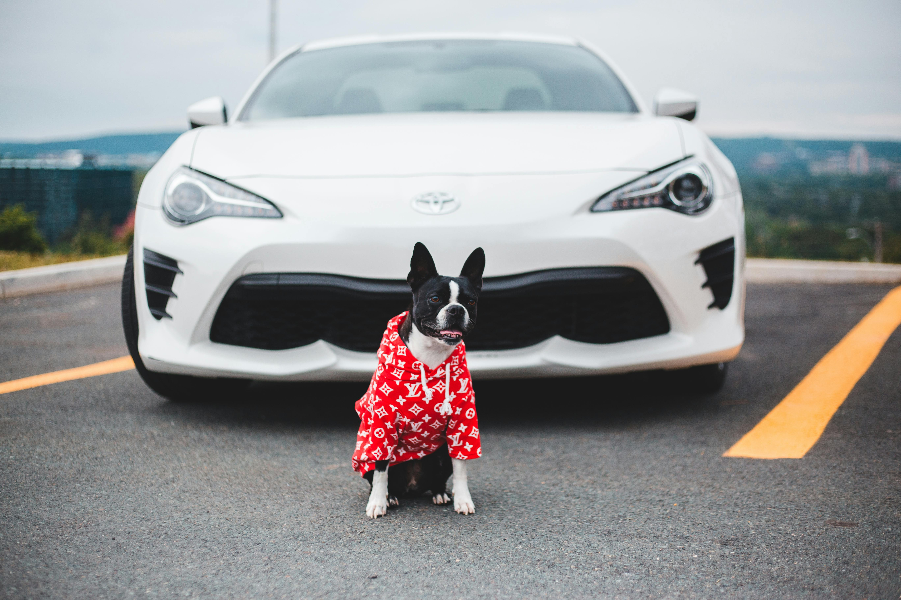
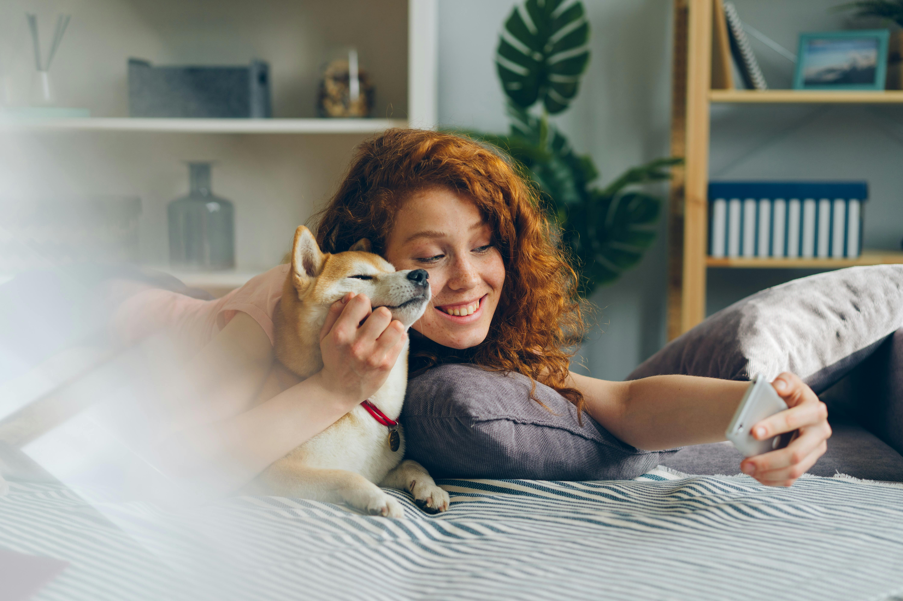

_This series of posts is derived from previous interviews and public discussions that I've had in the past. Enjoy!_

### **What is the cause of the rise in dog ownership across the West?**

It is a multifactorial phenomenon, but we argue that one contributing factor is social isolation, which is especially prevalent in individualistic, Western countries. Our main [hypothesis](https://link.springer.com/article/10.1007/s42977-025-00264-4) is that a lack of fulfilling relationships with other humans leaves certain fundamental human needs unmet. In response to that, one strategy is to turn to pets, whose social and emotional functions are now highly valued. This is especially true in the case of dogs, due to their socio-cognitive skills and impressive adaptation to our communication systems.

Other factors include imitation and social learning: we tend to like and do what others like and do. Of course, the increased emotional, time, and financial investment into dog ownership was also made possible by the socio-economic context of Western countries, that are wealthier than in pre-industrial times.

### **What is the role of the pet dog industry in shaping contemporary dog ownership culture? Is commercialization reinforcing the idea of dogs as full-fledged family members, or might it obscure some important concerns related to animal welfare?**

The growing pet dog industry both reflects and reinforces a cultural shift: we increasingly view dogs as emotionally significant members of the family. The more we invest financially in pets, the more we tend to value them emotionally. In that sense, commercialization doesn’t just follow cultural trends but helps shaping them.

However, when it comes to animal welfare, it's important to be critical. While many pet products are marketed as enhancing well-being, most are designed more for the owner’s convenience or emotional gratification than for meeting the actual needs of the dog. True welfare isn’t about accessories or apps but about providing dogs with adequate physical activity, social interaction, and a degree of autonomy. These are the core elements of a good life for a dog, and they can’t be purchased off a shelf.

So yes, commercialization can deepen our emotional connection to dogs, but it can also obscure essential questions about what dogs genuinely need to thrive.

### **How do social media impact our relationship with dogs, and pets in general?**

According to some [studies](https://www.mdpi.com/2076-2615/14/23/3458), pet-related content is one of the most viewed on social media. These platforms are therefore likely a powerful way to popularize pet-related practices and attitudes – for better or worse. The more you are exposed, for instance, to certain training methods or breeds, the more likely you are to adopt them, especially when they are also endorsed by popular creators. Unfortunately, some of these trends have detrimental consequences for animals. When puppies from a specific breed become highly sought after, some may see this as a business opportunity, leading to questionable – or even illegal – practices (e.g., puppy mills, or the theft and resale of purebred dogs). But not all popular dog breeds (or pet species) are suitable for all individuals. Other [studies](https://www.mdpi.com/2076-2615/9/8/480) have also shown how social media influences the market of exotic pets, in connection with illegal trade.

The exposure of pets on social media may also serve as an online symbolic extension of the self. Here, the pet (and its image) may be thought of as a [prized possession](https://www.sciencedirect.com/science/article/abs/pii/S014829630700197X) that reflects who we are and to which social groups we belong to – which may be especially important for building one’s identity in individualistic, consumer societies. In one of my ongoing research projects, I found that for many pet owners, there is a positive correlation between how much they love their pet and how much they enjoy other people admiring their pet and holding a positive image of them. Some people are also taking advantage of the popularity of pet-related content to use their pet to sell something, be it their own image, consumer products, or political ideologies.

On the bright side, using social media as a pet owner is an easy way to connect with like-minded pet lovers, with whom to share the joys and struggles of daily life; it’s also a good opportunity to discover pet-friendly places and activities around you.

## Further readings

Beverland, M. B., Farrelly, F., & Lim, E. A. C. (2008). Exploring the dark side of pet ownership: Status- and control-based pet consumption. Journal of Business Research, Animal Companions, Consumption Experiences, and the Marketing of Pets: Transcending Boundaries in the Animal-Human Distinction, 61(5), 490–496. <https://doi.org/10.1016/j.jbusres.2006.08.009>

Kubinyi, E. (2025). The Link Between Companion Dogs, Human Fertility Rates, and Social Networks. Current Directions in Psychological Science, 34(4), 232–239. <https://doi.org/10.1177/09637214251318284>

Kubinyi, E., & Turcsán, B. (2025). From kin to canines: Understanding modern dog keeping from both biological and cultural evolutionary perspectives. Biologia Futura, 76(2), 213–220. <https://doi.org/10.1007/s42977-025-00264-4>

Spee, L. B., Hazel, S. J., Dal Grande, E., Boardman, W. S. J., & Chaber, A.-L. (2019). Endangered Exotic Pets on Social Media in the Middle East: Presence and Impact. Animals : An Open Access Journal from MDPI, 9(8), 480. <https://doi.org/10.3390/ani9080480>

Zhang, X., He, Y., Yang, S., & Wang, D. (2024). Human Preferences for Dogs and Cats in China: The Current Situation and Influencing Factors of Watching Online Videos and Pet Ownership. Animals, 14(23), Article 23. <https://doi.org/10.3390/ani14233458>
