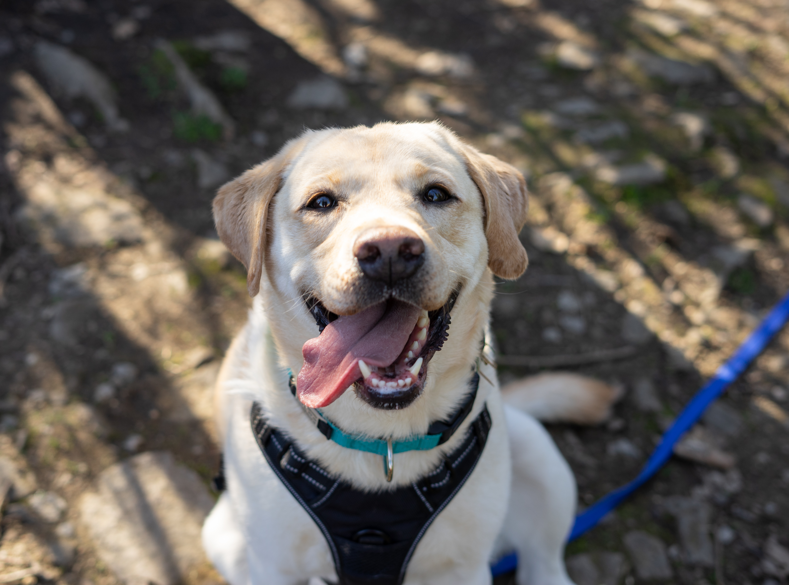
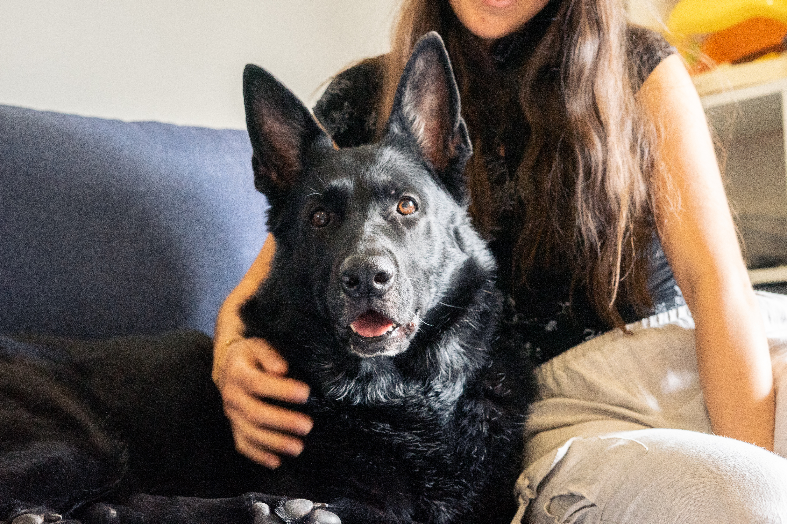
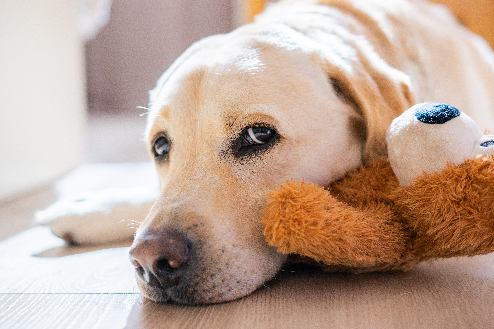

_This series of posts is derived from previous interviews and public discussions that I’ve had in the past. Enjoy!_

### **Does owning a dog replace having children in Western societies?**

We argue that the surge in dog ownership and [dog parenting](https://www.mdpi.com/2076-2615/15/23/3358) is a consequence rather than a cause of falling birth rates. More and more people who could have children don’t want any for a wide range of reasons that have nothing to do with pets. In this context, for some people, dog ownership may represent the opportunity to build a family and perform parenting behaviours on their own terms, without compromising on deeper values.

### **Do dogs elicit a similar emotional response in owners as babies do to parents?**

Research showed that dogs get [attached](https://pubmed.ncbi.nlm.nih.gov/9770312/) to their owners the same way babies get attached to their parents. In that sense, they show similar behaviours, for instance, they prefer to explore a new place when their owner is there, too. In return, dogs seem to be able to trigger our caregiving system. This translates, for instance, into the way we talk to them, with a [baby voice](https://royalsocietypublishing.org/doi/full/10.1098/rspb.2016.2429), to which they are responsive. In one fMRI [study](https://journals.plos.org/plosone/article?id=10.1371/journal.pone.0107205) viewing pictures of one’s dog and one’s baby was found to activate a common network of brain regions – and when they asked the participants, emotional ratings for children and dogs were similar. We are also sensitive to the physical appearance of dogs with infantile traits, for instance round face, big eyes and small nose. Puppies seem to be especially attractive to us, in comparison to adult dogs.

### **Do dog owners get ‘baby blues’?**

[Puppy blues](https://www.nature.com/articles/s44184-024-00072-z) is a new concept in the scientific literature, but it seems that yes, new puppy owners share – to a certain extent – the same experience than parents of newborns. What researchers mean by puppy blues is a temporary negative emotional state triggered by the significant life change of a new puppy’s arrival. It’s characterized for instance by anxiety, difficulty sleeping, irritability, mood swings… Some common thoughts are that owners feel they’re not able to meet their dog’s needs and feel incompetent or guilty, they may even question their choice. But it is not a universal phenomenon, so not everyone experiences it.

### **Do we, as humans and as a social species, feel the need to care for other creatures, not necessarily humans?**

Evolutionarily speaking, one [theory](https://www.researchgate.net/publication/285988163_Pets_in_the_Family_An_Evolutionary_Perspective) is that caring for an infant from another species results from an error in the mechanisms responsible for human parenting behaviour. Hunter-gatherers practiced alloparenting (or [cooperative breeding](https://cognitionandculture.net/wp-content/uploads/HrdyInCarter2005.pdf)), meaning that they cared for all infants in the community, regardless of genetic relationships. Humans also evolved other social abilities, such as empathy, cooperation, and the understanding of others’ thinking (theory of mind), which may have been extended to non-human animals through anthropomorphic thinking.

Therefore, while we, as humans, show an innate attraction to infants, we did not need to develop mechanisms to discriminate between kin and non-kin. Together with anthropomorphism, this may explain why humans enjoy caring for pets. But we argue that this phenomenon was massively amplified by recent changes in our environment, including a drop in fertility rates over the last decades: where there are fewer humans to connect with and care for (especially infants), pets may emerge as an alternative target. In other words, [cultural evolution](https://www.researchgate.net/publication/389865273_The_Link_Between_Companion_Dogs_Human_Fertility_Rates_and_Social_Networks) may have promoted pet parenting as an attempt to adapt to a quickly changing world.

### **With the rise of “dog parenting” culture, is there a risk that dogs may be assigned overly high emotional expectations in human relationships? Could such expectations intensify dependence on dogs and, conversely, contribute to a form of interpersonal detachment?**

Like in human-human relationships, extreme interdependence is rarely beneficial. For instance, separation would be perceived as a distressing event for both the dog and the owner. In terms of canine welfare, a dog that is well-socialized, comfortable in the presence of strangers, and able to enjoy some alone time is likely to be a happy, serene dog. The risk of over-investing in the relationship with the dog is that the owner may disengage too much from other relationships, weakening their general support system - instead of strengthening it by meeting new people through the dog, for instance.

Overly high emotional expectations put on dogs might also mean that they should always be available to answer our needs. Yet, like us, they sometimes need space and time to enjoy their own activities. The fact that not all dogs strongly reject unwanted physical contact doesn't mean that they always enjoy it. That is also why some people argue that dogs should be loved for what they are, not for what they provide us.

## Further readings

Ben-Aderet, T., Gallego-Abenza, M., Reby, D., & Mathevon, N. (2017). Dog-directed speech: Why do we use it and do dogs pay attention to it? Proceedings of the Royal Society B: Biological Sciences, 284(1846), 20162429. <https://doi.org/10.1098/rspb.2016.2429>

Hrdy, S. B. (2007). Evolutionary Context of Human Development: The Cooperative Breeding Model. In C. A. Salmon & T. K. Shackelford (Eds), Family Relationships: An Evolutionary Perspective (p. 0). Oxford University Press. <https://doi.org/10.1093/acprof:oso/9780195320510.003.0003>

Kubinyi, E. (2025). The Link Between Companion Dogs, Human Fertility Rates, and Social Networks. Current Directions in Psychological Science, 34(4), 232–239. <https://doi.org/10.1177/09637214251318284>

Serpell, J., & Paul, E. (2011). Pets in the Family: An Evolutionary Perspective. In T. K. Shackelford & C. Salmon (Eds), The Oxford Handbook of Evolutionary Family Psychology (p. 0). Oxford University Press. <https://doi.org/10.1093/oxfordhb/9780195396690.013.0017>

Ståhl, A., Salonen, M., Hakanen, E., Mikkola, S., Sulkama, S., Lahti, J., & Lohi, H. (2024). Development and validation of the puppy blues scale measuring temporary affective disturbance resembling baby blues. Npj Mental Health Research, 3(1), 1–10. <https://doi.org/10.1038/s44184-024-00072-z>

Stoeckel, L. E., Palley, L. S., Gollub, R. L., Niemi, S. M., & Evins, A. E. (2014). Patterns of Brain Activation when Mothers View Their Own Child and Dog: An fMRI Study. PLOS ONE, 9(10), e107205. <https://doi.org/10.1371/journal.pone.0107205>

Topál, J., Miklósi, Á., Csányi, V., & Dóka, A. (1998). Attachment behavior in dogs (Canis familiaris): A new application of Ainsworth’s (1969) Strange Situation Test. Journal of Comparative Psychology, 112(3), 219–229. <https://doi.org/10.1037/0735-7036.112.3.219>

Udvarhelyi-Tóth, K. M., Szalma, I., Pélyi, L., Udvari, O., Kispeter, E., & Kubinyi, E. (2025). “My Little Son, My Everything”: Comparative Caregiving and Emotional Bonds in Dog and Child Parenting. Animals, 15(23), 3358. <https://doi.org/10.3390/ani15233358>
