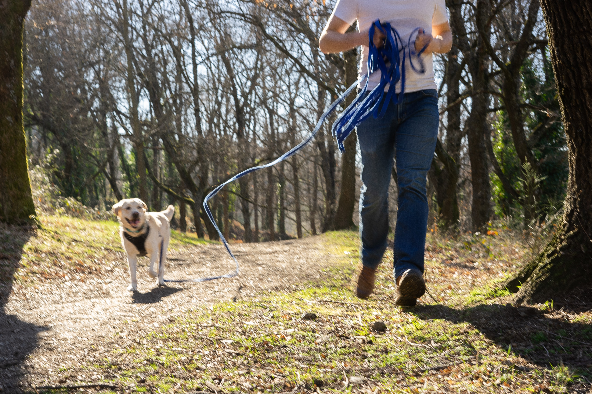

_This series of posts is derived from previous interviews and public discussions that I've had in the past. Enjoy!_

### **What insights can the “functional role” (child-like, partner-like etc.) of dogs in the family offer us in rethinking the very concept of family today?**

More than ever, the place given to dogs in many human families is calling into question the boundary between animals and humans. Sociologists have referred to it as [“more-than-human families”](https://www.researchgate.net/publication/313406596_More-than-human_families_Pets_people_and_practices_in_multispecies_households) or “multispecies families”, positioning pet animals in an “in-between” role - humanized, but not fully human. Dogs have become unique family members, blending characteristics of a child, sibling, partner, or parent, depending on our emotional needs at a given time and the [life stage](https://www.tandfonline.com/doi/abs/10.1300/J039v09n04_02) we are in. Additionally, child-free lifestyles are rising across the globe for various reasons. For young people especially, dogs may represent the opportunity to build a family of their own and in a way, fulfil social expectations of family formation, on their own terms, without compromising on deeper values.

### **What do dogs provide emotionally to their owners that other forms of companionship (like human friends or partners) might not?**

What we found in another [study](https://www.nature.com/articles/s41598-025-95515-8) comparing the characteristics of different relationships is that our relationship with dogs is usually less conflictual, more supportive, and generally more satisfying than relationships with other human partners. Respondents also reported having more relative power over their dogs than over other human partners, which may fulfil owners' need for control.

The high dependency of dogs on their caregivers, as well as selection for cooperative traits in them, likely contributes to this: dogs are overwhelmingly described as non-judgmental, loyal, and unconditionally affectionate.

In short, the flexibility of pet relationships, as well as the reduced risk of conflict inherent to them, makes them particularly safe and comforting, especially for people with insecure attachment styles who are sensitive to rejection or abandonment.

### **How will the role of dogs within human families continue to evolve — are we heading towards even deeper emotional bonds, or are there limits to this trend?**

Since the COVID-19 pandemic, loneliness and isolation have never been more prevalent. If this trend continues over time, we can hypothesize that the emotional importance of pets in human lives will only keep growing; in other words, it may be a coping strategy to face a lack of fulfilling human relationships. Moreover, in our current research projects, we consistently find that some people regard their dog as the most important individual in their lives; the question is now why. In a way, we can describe this emotional bond as the most 'extreme': valuing dogs above all other human partners.

### **Pets can be children, but also friends… What are the differences?**

Current literature suggests that how owners regard their pets depends primarily on their own circumstances and needs, rather than on the animal itself. For instance, age, gender, and family status, but also more broadly, [attitudes towards animals](https://www.tandfonline.com/doi/abs/10.2752/175303713X13636846944402), may influence the perception of the relationship. The good news is that dogs adapt easily to our expectations and to what we project onto them — in other words, they can be almost anything we want them to be, even as what we want changes over time.

### **Are there any cultural differences in how people integrate dogs into family life — for example, are dogs seen more as friends, children, or even partners in different regions of the world?**

There is a globally emerging trend of regarding dogs as children, or at least of engaging in dog parenting practices. Yet, previous studies have mostly documented this phenomenon in societies undergoing a Second Demographic Transition and/or WEIRD societies (e.g., the US, the UK, Japan, Finland…).

In other societies, recent [findings](https://www.mdpi.com/2076-2615/9/8/514) suggest that this phenomenon is also emerging among sociodemographic groups with similar characteristics: urban, highly educated, and financially comfortable young owners. Meanwhile, in several regions of the world, dogs still fulfil practical roles, such as guarding and hunting, rather than 'humanized' ones. Religious and cultural background also shapes attitudes and practices towards animals in general, which is reflected in the roles attributed to dogs and in how socially acceptable it is to refer to them in humanized terms.

## Further readings

Blouin, D. D. (2013). Are Dogs Children, Companions, or Just Animals? Understanding Variations in People’s Orientations toward Animals. Anthrozoös, 26(2), 279–294. <https://doi.org/10.2752/175303713X13636846944402>

Irvine, L., & Cilia, L. (2017). More-than-human families: Pets, people, and practices in multispecies households. Sociology Compass, 11(2), e12455. <https://doi.org/10.1111/soc4.12455>

Turcsán, B., Ujfalussy, D. J., Kerepesi, A., Miklósi, Á., & Kubinyi, E. (2025). Similarities and differences between dog–human and human–human relationships. Scientific Reports, 15(1), 11871. <https://doi.org/10.1038/s41598-025-95515-8>

Turner, W. G. (2006). The Role of Companion Animals Throughout the Family Life Cycle. Journal of Family Social Work, 9(4), 11–21. <https://doi.org/10.1300/J039v09n04_02>

Volsche, S., Mohan, M., Gray, P. B., & Rangaswamy, M. (2019). An Exploration of Attitudes toward Dogs among College Students in Bangalore, India. Animals, 9(8), Article 8. <https://doi.org/10.3390/ani9080514>
