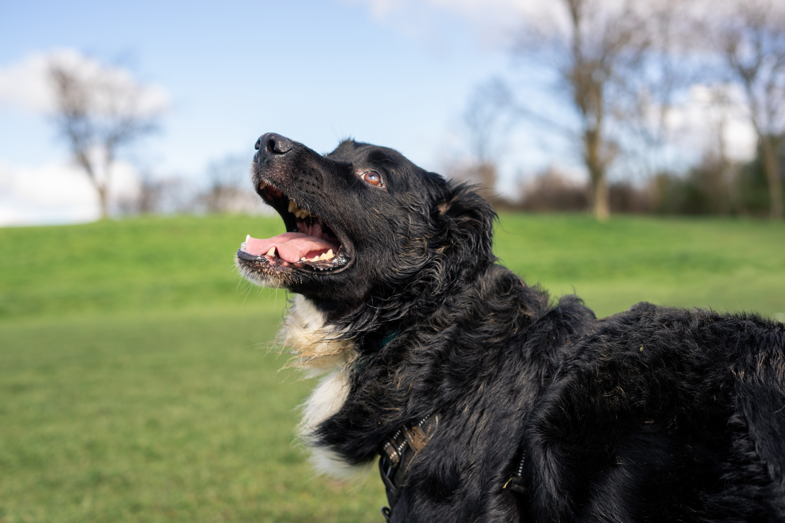

_Cette série d'articles est tirée d'interviews et de discussions publiques que j'ai eues par le passé. Bonne lecture !_

### **Que peut nous enseigner le « rôle fonctionnel » du chien dans la famille (enfant, partenaire, etc.) sur la façon dont nous repensons le concept même de famille aujourd'hui ?**

Plus que jamais, la place accordée aux chiens dans de nombreuses familles humaines remet en question la frontière entre animaux et humains. Les sociologues y ont fait référence sous le terme de [« familles plus qu'humaines »](https://www.researchgate.net/publication/313406596_More-than-human_families_Pets_people_and_practices_in_multispecies_households) ou « familles multi-espèces », positionnant ainsi les animaux de compagnie dans un rôle « intermédiaire » — humanisés, mais pas pleinement humains. Les chiens sont devenus des membres de famille uniques, mêlant les caractéristiques d'un enfant, d'un frère ou d'une sœur, d'un partenaire ou d'un parent, selon nos besoins émotionnels à un moment donné et [l'étape de vie](https://www.tandfonline.com/doi/abs/10.1300/J039v09n04_02) dans laquelle nous nous trouvons. Par ailleurs, les modes de vie sans enfants (childfree) sont en hausse dans le monde entier pour diverses raisons. Pour les jeunes en particulier, les chiens peuvent représenter l'opportunité de fonder une famille et, d'une certaine manière, de répondre aux attentes sociales en matière de formation d'une famille, selon leurs propres conditions, sans compromettre leurs valeurs profondes.

### **Qu'est-ce que les chiens apportent émotionnellement à leurs propriétaires que d'autres formes de compagnie (comme les amis humains) ne peuvent pas offrir ?**

Ce que nous avons découvert dans une autre [étude](https://www.nature.com/articles/s41598-025-95515-8) comparant les caractéristiques de différentes relations, c'est que notre relation avec les chiens est généralement moins conflictuelle, plus soutenante et globalement plus satisfaisante que les relations avec d'autres partenaires humains. Dans cette étude, les participants ont également déclaré avoir plus de pouvoir relatif sur leurs chiens que sur d'autres partenaires humains, ce qui peut satisfaire un certain besoin de contrôle.

La forte dépendance des chiens envers leurs gardiens humains, ainsi que la sélection pour des traits coopératifs chez eux, contribue probablement à cela : les chiens sont massivement décrits comme non-jugeants, loyaux et capables de nous aimer inconditionnellement.

En résumé, la flexibilité de nos relations avec les animaux de compagnie, ainsi que le risque réduit de conflit qui leur est inhérent, les rend particulièrement sécurisantes et réconfortantes, en particulier pour les personnes ayant des styles d'attachement insécures, sensibles au rejet ou à l'abandon.

### **Comment le rôle des chiens au sein des familles humaines va-t-il continuer à évoluer ? Allons-nous vers des liens émotionnels encore plus profonds, ou existe-t-il des limites à cette tendance ?**

Depuis la pandémie de COVID-19, la solitude et l'isolement n'ont jamais été aussi répandus. Si cette tendance se poursuit dans le temps, on peut émettre l'hypothèse que l'importance émotionnelle des animaux de compagnie dans la vie humaine ne fera que croître ; en d'autres termes, il peut s'agir d'une stratégie d'adaptation face à un manque de relations humaines épanouissantes. De plus, dans nos projets de recherche actuels, nous constatons régulièrement que certaines personnes considèrent leur chien comme l'individu le plus important de leur vie ; la question est désormais de savoir pourquoi. D'une certaine façon, nous pouvons décrire ce lien émotionnel comme le plus « extrême » : valoriser les chiens au-dessus de tous les autres partenaires humains.

### **Les animaux peuvent être des enfants, mais aussi des amis… Quelles sont les différences ?**

La littérature actuelle suggère que la façon dont les propriétaires considèrent leurs animaux dépend principalement de leurs propres circonstances et besoins, plutôt que de l'animal lui-même. Par exemple, l'âge, le genre et la situation familiale, mais aussi, plus généralement, les [attitudes envers les animaux](https://www.tandfonline.com/doi/abs/10.2752/175303713X13636846944402), peuvent influencer la perception de la relation. La bonne nouvelle est que les chiens s'adaptent facilement à nos attentes et à ce que nous projetons sur eux — en d'autres termes, ils peuvent être presque tout ce que nous voulons qu'ils soient, même lorsque ce que nous voulons change au fil du temps.

### **Existe-t-il des différences culturelles dans la façon dont les gens intègrent les chiens dans la vie familiale — par exemple, les chiens sont-ils davantage perçus comme des amis, des enfants, voire des partenaires selon les régions du monde ?**

Le fait de considérer les chiens comme des enfants, ou du moins l'adoption de pratiques de « dog parenting », est une tendance qui émerge dans le monde entier. Pourtant, les études précédentes ont surtout documenté ce phénomène dans les sociétés en cours de Deuxième Transition Démographique et/ou dans les sociétés WEIRD (par exemple, les États-Unis, le Royaume-Uni, le Japon, la Finlande…).

Dans d'autres sociétés, de récentes [découvertes](https://www.mdpi.com/2076-2615/9/8/514) suggèrent que ce phénomène émerge également parmi des groupes sociodémographiques aux caractéristiques similaires : des jeunes propriétaires urbains, très éduqués et financièrement à l'aise. Parallèlement, dans plusieurs régions du monde, les chiens remplissent encore des rôles pratiques, comme la garde et la chasse, plutôt que des rôles « humanisés ». Le contexte religieux et culturel façonne également les attitudes et pratiques envers les animaux en général, ce qui se reflète dans les rôles attribués aux chiens, mais aussi à quel point il est socialement acceptable de se référer à eux en termes humanisés.

## Lectures complémentaires (en anglais)

Blouin, D. D. (2013). Are Dogs Children, Companions, or Just Animals? Understanding Variations in People's Orientations toward Animals. Anthrozoös, 26(2), 279–294. <https://doi.org/10.2752/175303713X13636846944402>

Irvine, L., & Cilia, L. (2017). More-than-human families: Pets, people, and practices in multispecies households. Sociology Compass, 11(2), e12455. <https://doi.org/10.1111/soc4.12455>

Turcsán, B., Ujfalussy, D. J., Kerepesi, A., Miklósi, Á., & Kubinyi, E. (2025). Similarities and differences between dog–human and human–human relationships. Scientific Reports, 15(1), 11871. <https://doi.org/10.1038/s41598-025-95515-8>

Turner, W. G. (2006). The Role of Companion Animals Throughout the Family Life Cycle. Journal of Family Social Work, 9(4), 11–21. <https://doi.org/10.1300/J039v09n04_02>

Volsche, S., Mohan, M., Gray, P. B., & Rangaswamy, M. (2019). An Exploration of Attitudes toward Dogs among College Students in Bangalore, India. Animals, 9(8), Article 8. <https://doi.org/10.3390/ani9080514>
